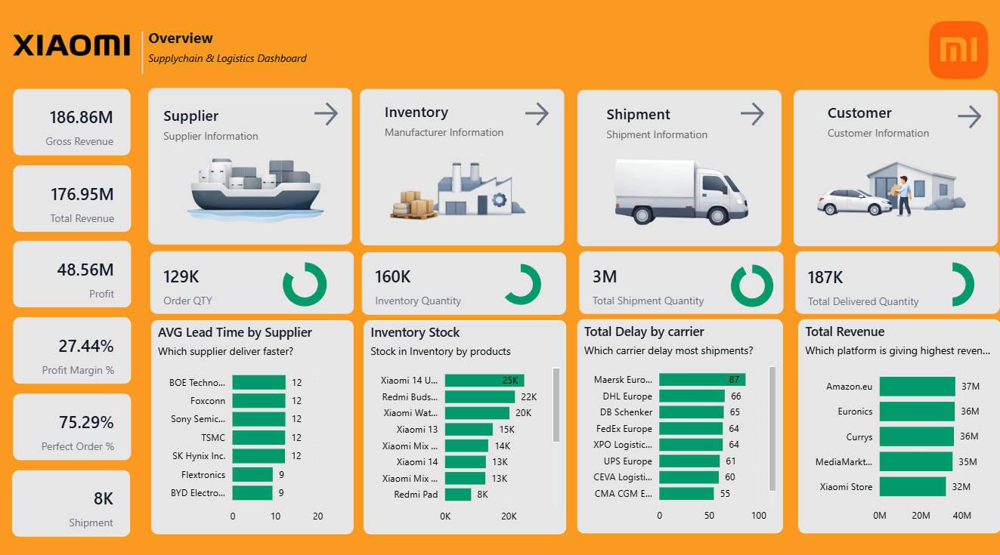
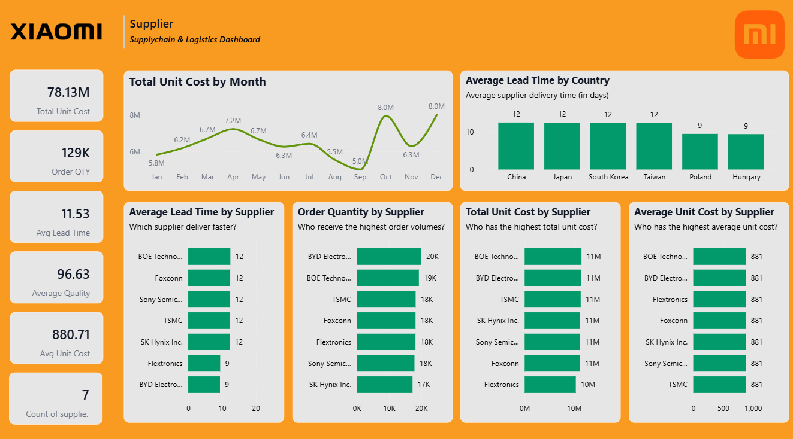
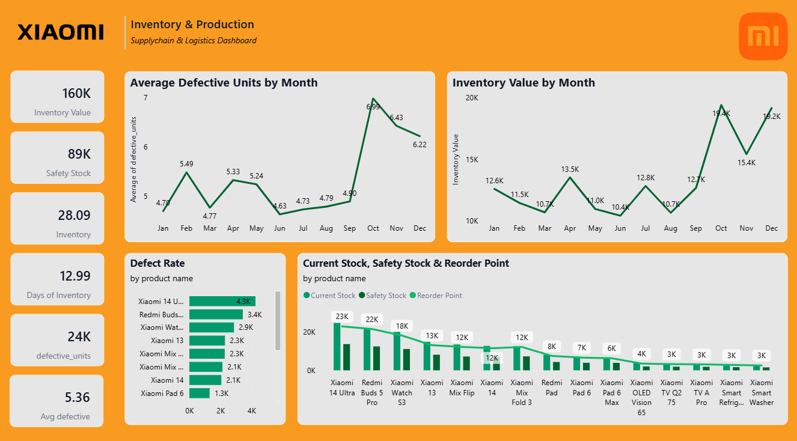
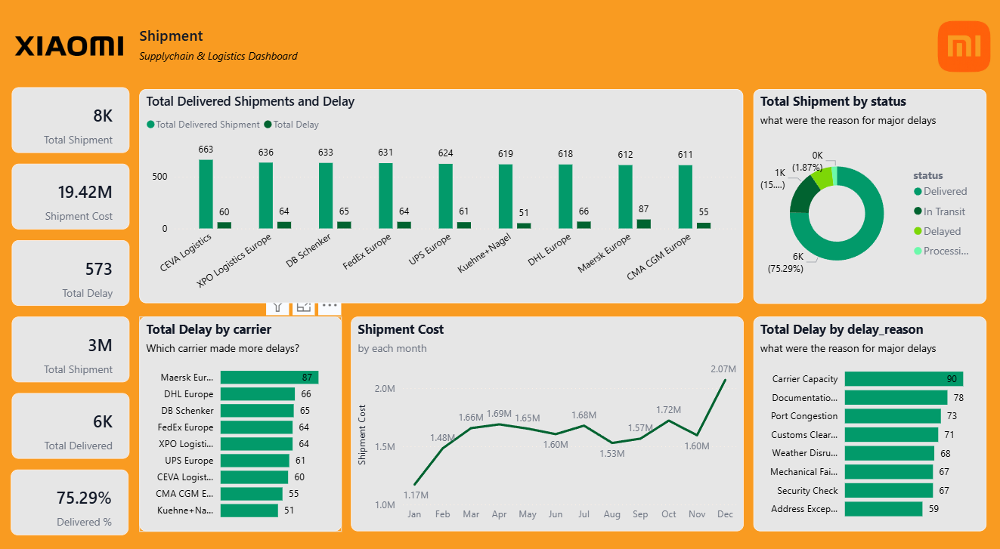
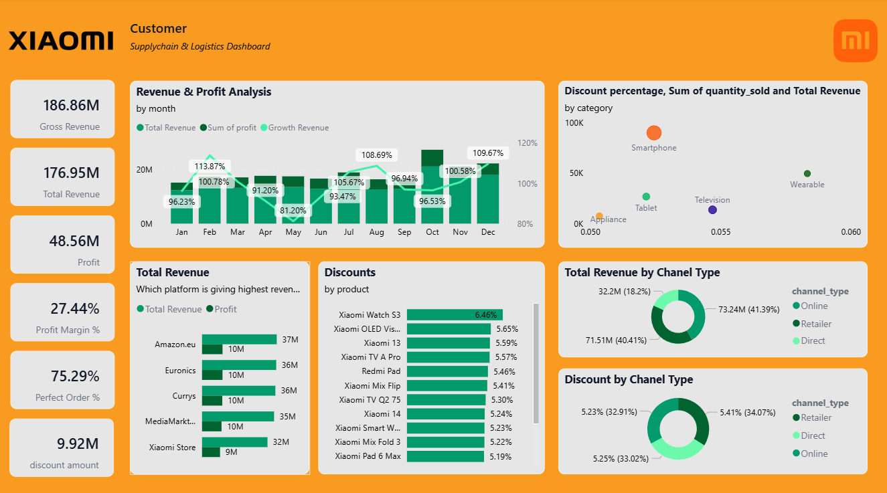

# 📦 Supply Chain & Logistics Analytics Dashboard

<p align="center">


</p>

An **interactive Power BI analytics solution** built to analyze and optimize supply chain operations across suppliers, inventory, logistics performance, and customer demand.

This dashboard transforms raw operational data into **actionable insights**, enabling stakeholders to monitor logistics performance, identify supply chain bottlenecks, and make data-driven operational decisions.

---

# 📌 Business Problem

Modern supply chains generate large volumes of operational data, yet many organizations lack **clear visibility into logistics performance and inventory behavior**.

Logistics teams faced several challenges:

• Limited visibility into **delivery delays and shipment performance**
• Difficulty identifying **underperforming suppliers**
• Poor monitoring of **inventory levels across distribution centers**
• Fragmented reporting across multiple data sources
• Delayed decision-making due to **manual reporting processes**

Without centralized analytics, operational inefficiencies often remained **hidden until they impacted business performance**.

---

# 🎯 Project Objective

The goal of this project was to develop an **interactive supply chain intelligence dashboard** that allows stakeholders to:

• Monitor logistics operations in real time
• Evaluate supplier reliability and delivery performance
• Track inventory levels across distribution centers
• Identify operational bottlenecks in shipments and logistics
• Analyze customer demand and revenue distribution

The solution provides a **single unified analytics platform** for supply chain monitoring and decision-making.

---

# 🛠 Tools & Technologies

| Category              | Tools                           |
| --------------------- | ------------------------------- |
| Business Intelligence | Power BI                        |
| Data Modeling         | Star Schema                     |
| Calculations          | DAX                             |
| Data Preparation      | Power Query                     |
| Data Sources          | Structured operational datasets |

---

# 🧩 Data Model

The dashboard uses a **star schema architecture** designed for efficient analytics.

### Fact Tables

• Shipments
• Orders
• Inventory movements

### Dimension Tables

• Suppliers
• Products
• Distribution centers
• Customers
• Time

This model enables:

• fast aggregation
• efficient filtering
• multi-dimensional analysis
• drill-down capabilities

---

# 📊 Dashboard Views

The Power BI dashboard consists of multiple analytical views designed to monitor different areas of supply chain operations.

---

## Executive Overview

<p align="center">

</p>

Provides a high-level summary of supply chain performance including:

• total shipments
• delivery performance metrics
• inventory levels
• logistics efficiency indicators

This page acts as the **main operational control panel for supply chain monitoring**.

---

## Supplier Performance Analysis

<p align="center">

</p>

This view evaluates supplier reliability and operational contribution.

Key insights include:

• supplier delivery consistency
• lead-time variations
• supplier shipment contribution

This enables organizations to **identify high-performing and underperforming suppliers**.

---

## Inventory Analytics

<p align="center">

</p>

Tracks inventory distribution across warehouses and distribution centers.

Key metrics include:

• stock levels
• excess inventory detection
• inventory shortages
• seasonal demand variations

This supports **inventory optimization and demand planning**.

---

## Shipment & Logistics Insights

<p align="center">

</p>

Analyzes shipment routes and transportation performance.

Key metrics:

• delivery timelines
• shipment route efficiency
• delay patterns
• logistics performance trends

This helps detect **logistics bottlenecks affecting delivery performance**.

---

## Customer Revenue Analytics

<p align="center">

</p>

Provides insights into customer demand and revenue contribution.

Key analytics include:

• regional revenue distribution
• product demand patterns
• customer purchase behavior

This allows businesses to **identify high-value customers and market trends**.

---

# 🔍 Key Insights

The dashboard analysis revealed several operational insights:

• Delivery delays were concentrated in **specific shipment routes**
• Some distribution centers showed **consistent inventory imbalances**
• A small number of suppliers accounted for **major shipment volumes**
• Seasonal demand fluctuations significantly affected inventory levels
• Customer revenue distribution highlighted **high-value market regions**

These insights help supply chain teams **prioritize operational improvements**.

---

# 📈 Business Impact

This analytics solution enables logistics teams to make **data-driven operational decisions**.

Expected business benefits include:

• Improved visibility into supply chain operations
• Faster identification of logistics bottlenecks
• Better supplier performance management
• Optimized inventory planning
• Enhanced demand forecasting

Estimated outcome:

**~15% reduction in inventory discrepancies and improved supply chain efficiency.**

---

# 📁 Project Structure

```
Supply-Chain-Logistics-PowerBI
│
├ Capstone Project 1 - Xiaomi Logistics.pbix
├ Overview.png
├ Supplier.png
├ Inventory.png
├ Shipment.png
├ Customer.png
└ README.md
```

---

# 🚀 How to Use

1️⃣ Download the `.pbix` file from this repository
2️⃣ Open using **Microsoft Power BI Desktop**
3️⃣ Explore interactive filters, slicers, and dashboards
4️⃣ Analyze supply chain KPIs across different views

---

# 💡 Future Improvements

Potential enhancements for this project include:

• integration with real-time logistics APIs
• predictive analytics for delivery delay forecasting
• machine learning models for demand forecasting
• automated alerts for supply chain anomalies
• cloud-based dashboard deployment

---

# 📌 Summary

This project demonstrates how **Power BI can transform operational supply chain data into meaningful business insights**.

By combining **data modeling, DAX calculations, and interactive visual analytics**, the dashboard provides a powerful decision-support tool for improving supply chain performance and operational efficiency.
